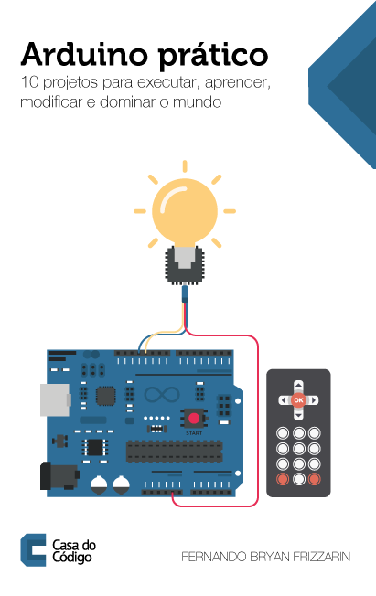

Aqui estão os arquivos fontes dos programas constantes do livro "Arduino: 10 projetos para executar, aprender, modificar e dominar o mundo" editado pela Casa do Código.

"Arduino é uma plataforma de prototipagem formada por uma placa eletrônica com um microprocessador e um ambiente de programação integrado. Recentemente, muito se tem discutido sobre seu uso em projetos de tecnologia: o que é possível fazer? Quais projetos criar? Como, de fato, colocar a mão na massa?

Neste livro, o prof. Fernando Frizzarin apresenta, com linguagem simples e acessível a praticamente qualquer pessoa, dez projetos que estimularão sua criatividade, desafiando-o a explorar o seu raciocínio e possibilitando o surgimento de novos ideários. Com a montagem e programação detalhada passo a passo, você poderá partir dos projetos preconcebidos, componentes e lógicas básicas para ir além, até onde sua imaginação permitir."

O livro pode ser adquirido na [Casa do Código - www.casadocodigo.com.br](http://www.casadocodigo.com.br)

